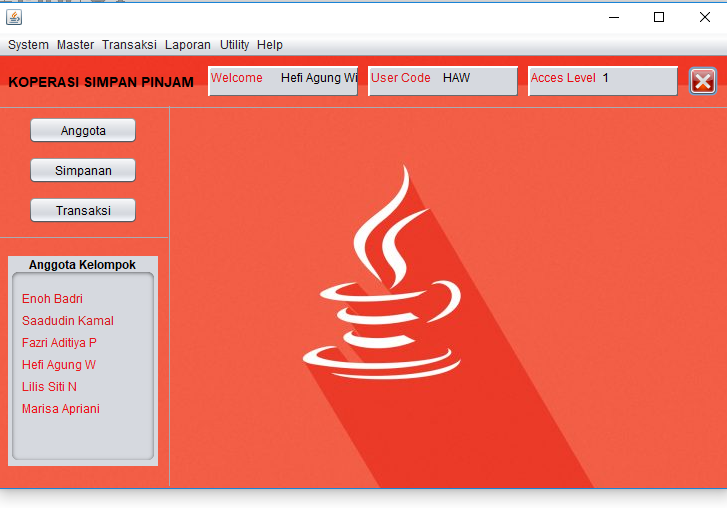
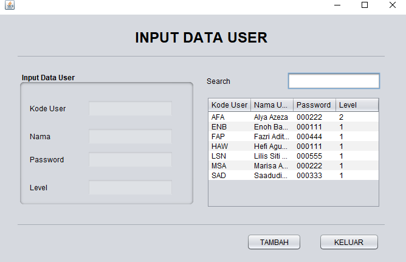
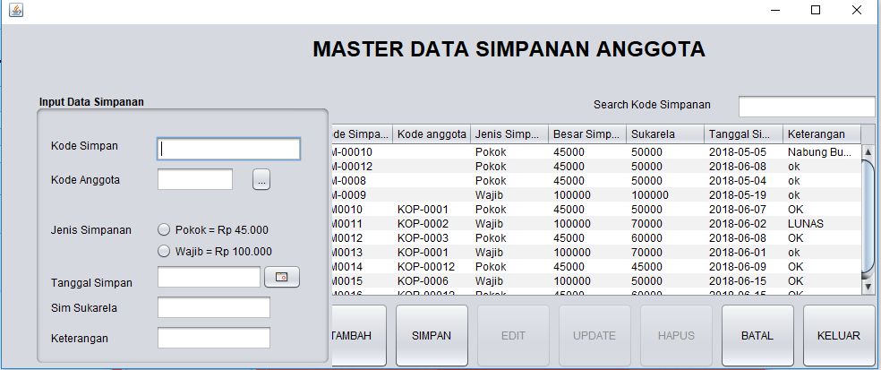
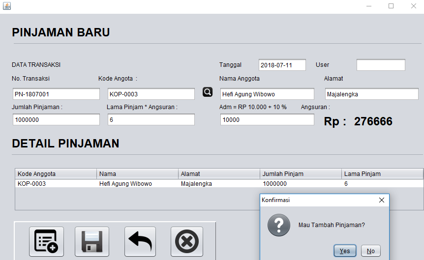

# aplikasi-koperasi-simpan-pinjam
Aplikasi Koperasi Simpan Pinjam Berbasis Desktop

Prerequisite:
- Netbeans IDE 8.2
- JDK 1.8.0
- Ireport 4.5.0 plugin
- Ireport 4.5.0 jar

### Dashboard
 

### Input Data User
 

### Input Data Anggota
 

### Master Data Simpanan
 

### Input Pinjaman Baru
 
